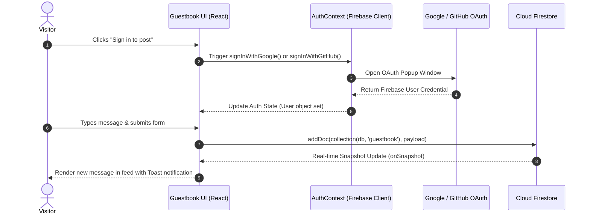
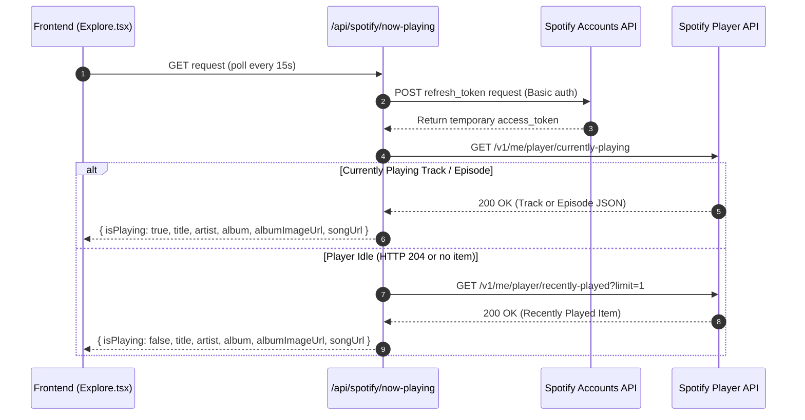
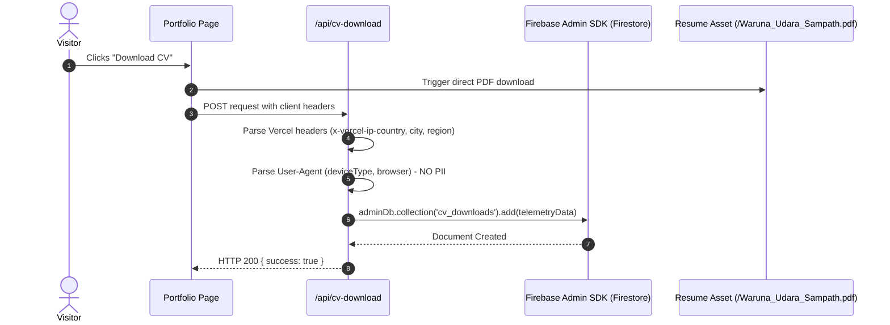
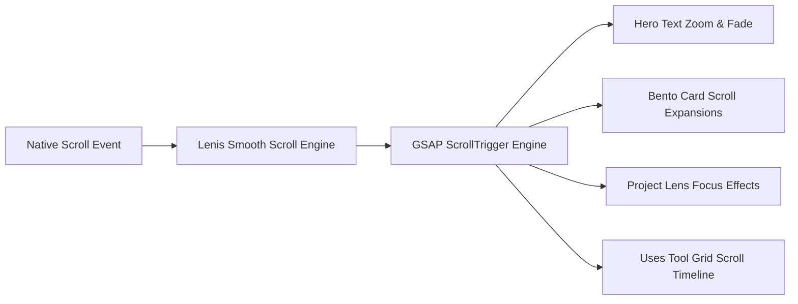

# Architectural Specification & Technical Blueprints

This document outlines the software architecture, design patterns, API integrations, data flows, database schemas, and animation pipelines for **Waruna Udara Sampath's Developer Portfolio** (`my-dev-portfolio`).

---

## 1. System Overview & Architecture

The application is engineered as a modern, serverless web application built on **Next.js 15 (App Router)** with **React 19** and **TypeScript 5**. It combines static asset optimization with serverless Edge API routes and client-side real-time rendering.

### High-Level Architectural Layers

```mermaid
graph TB
    subgraph Client Layer
        A[Next.js App Router Page]
        B[Lenis Smooth Scroll Engine]
        C[GSAP & Framer Motion Pipelines]
        D[AuthContext / Firebase Client SDK]
    end

    subgraph Edge / API Route Layer
        E[/api/spotify/now-playing]
        F[/api/github/stats]
        G[/api/github/contributions]
        H[/api/cv-download]
    end

    subgraph External Infrastructure
        I[(Cloud Firestore)]
        J[Firebase Auth Provider]
        K[Spotify Web API]
        L[GitHub GraphQL & REST API]
    end

    A --> B
    A --> C
    A --> D
    D <--> J
    A --> I
    A --> E
    A --> F
    A --> G
    A --> H
    E --> K
    F --> L
    G --> L
    H --> I
```

---

## 2. Real-Time Guestbook & Authentication Flow

The Guestbook feature enables authenticated visitors to post comments. Authentication is handled via Firebase Authentication popups (Google and GitHub providers), while real-time updates are driven by Firestore listeners.

### Authentication & Message Posting Sequence



---

## 3. Spotify Live Activity Integration Pipeline

The `/api/spotify/now-playing` endpoint provides real-time music updates or falls back to recently played history when no track is active.

### Spotify OAuth 2.0 Refresh & Fallback Sequence



---

## 4. Privacy-Preserving Telemetry & CV Download Tracking

The `/api/cv-download` route logs anonymized metadata when visitors download the developer's resume. Geolocation headers provided by the Vercel Edge Runtime are captured without recording IP addresses or personal identity.

### Telemetry Pipeline Sequence



---

## 5. Data Models & Database Schemas

### 5.1 Firestore `guestbook` Collection

Each entry in `guestbook` represents a user comment:

```json
{
  "id": "auto_generated_firestore_doc_id",
  "uid": "firebase_auth_user_uid",
  "name": "Waruna Udara Sampath",
  "email": "user@example.com",
  "photoURL": "https://lh3.googleusercontent.com/a/...",
  "message": "Great portfolio! Outstanding design and smooth animations.",
  "timestamp": "Timestamp(seconds=1740000000, nanoseconds=0)"
}
```

### 5.2 Firestore `cv_downloads` Collection

Each entry in `cv_downloads` records anonymized analytics:

```json
{
  "id": "auto_generated_firestore_doc_id",
  "country": "LK",
  "region": "11",
  "city": "Colombo",
  "deviceType": "desktop",
  "browser": "Chrome",
  "referer": "https://warunadev.vercel.app/",
  "timestamp": "FieldValue.serverTimestamp()"
}
```

---

## 6. UI Animation & Scroll Pipeline

The portfolio relies on a synchronized animation setup linking **Lenis** smooth scrolling with **GSAP ScrollTrigger** and **Framer Motion**:



### Scroll & Animation Synchronization Rules
1. **Lenis Integration**: Wrapped at root level via [`components/SmoothScroll.tsx`](file:///Users/warunaudarasampath/Documents/projects/my-portfolio/my-dev-portfolio/components/SmoothScroll.tsx).
2. **GSAP ScrollTrigger**: Configured with `scrub: true` or custom ease functions across sections ([`app/sections/Hero.tsx`](file:///Users/warunaudarasampath/Documents/projects/my-portfolio/my-dev-portfolio/app/sections/Hero.tsx), [`app/sections/Projects.tsx`](file:///Users/warunaudarasampath/Documents/projects/my-portfolio/my-dev-portfolio/app/sections/Projects.tsx), [`app/uses/page.tsx`](file:///Users/warunaudarasampath/Documents/projects/my-portfolio/my-dev-portfolio/app/uses/page.tsx)).
3. **Typography**: Split-type typography effects integrated for smooth letter and word reveals.

---

## 7. Structural Hubs & Core Modules

According to graph analysis performed via AST extraction (`graphify`):

| Structural Hub | Hub Type | Edges / Connectors | Responsibilities |
| :--- | :--- | :--- | :--- |
| [`cn()`](file:///Users/warunaudarasampath/Documents/projects/my-portfolio/my-dev-portfolio/lib/utils.ts#L4) | Utility Hub | 19 Edges | Merges Tailwind classes dynamically using `clsx` and `tailwind-merge` |
| [`NavBar()`](file:///Users/warunaudarasampath/Documents/projects/my-portfolio/my-dev-portfolio/app/ui/TubelightNavbar.tsx#L40) | Navigation Hub | 7 Edges | Floating tubelight navigation bar across main routes |
| [`Footer()`](file:///Users/warunaudarasampath/Documents/projects/my-portfolio/my-dev-portfolio/app/sections/Footer.tsx#L8) | Section Hub | 6 Edges | Site-wide footer with quick links, status indicators, and branding |
| [`GET()`](file:///Users/warunaudarasampath/Documents/projects/my-portfolio/my-dev-portfolio/app/api/spotify/now-playing/route.ts#L159) | Server API Hub | 6 Edges | Serverless route handlers processing external API requests |
| [`GuestbookPage()`](file:///Users/warunaudarasampath/Documents/projects/my-portfolio/my-dev-portfolio/app/guestbook/page.tsx#L54) | Feature Hub | 4 Edges | Real-time guestbook UI with Firebase authentication and Firestore listeners |
