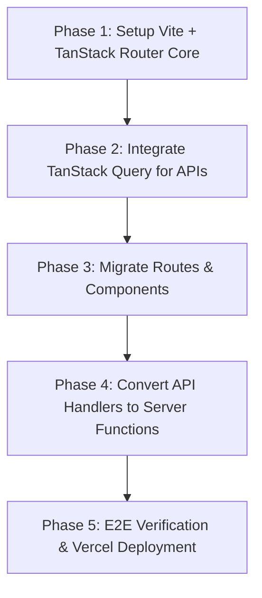

# Deep Architectural Analysis: Migrating to TanStack Ecosystem

This document provides an in-depth technical evaluation, feasibility analysis, risk assessment, and migration roadmap for transitioning **my-dev-portfolio** from **Next.js 15 (App Router)** to the **TanStack Ecosystem** (**TanStack Start / TanStack Router + TanStack Query + TanStack Form**).

---

## Executive Summary

The portfolio currently utilizes Next.js 15 with React 19, Tailwind CSS v4, Firebase (Auth + Firestore), GSAP, and serverless Edge API routes. Notably, **90%+ of existing section components already explicitly declare `"use client"`**, making the codebase uniquely suited for migration to TanStack Router & TanStack Start.

Migrating to TanStack provides **100% type-safe routing**, **granular search param management**, **elimination of Next.js-specific bundle overhead**, and **faster Vite-powered HMR and builds**.

---

## 1. System-by-System Component Mapping

| Subsystem / Feature | Current Next.js 15 Implementation | Target TanStack Architecture | Complexity / Effort |
| :--- | :--- | :--- | :--- |
| **Routing** | File-based App Router (`app/page.tsx`, `app/guestbook/page.tsx`, etc.) | **TanStack Router** file-based routing (`routes/index.tsx`, `routes/guestbook.tsx`, etc.) | 🟢 Low (Direct 1:1 mapping) |
| **API Endpoints** | Route Handlers (`app/api/spotify/now-playing/route.ts`, etc.) | **TanStack Start Server Functions** (`createServerFn`) or Nitro API routes | 🟡 Medium (Refactor handlers) |
| **Data Fetching** | Client-side `useEffect` + native `fetch` | **TanStack Query** (`@tanstack/react-query`) with automatic caching & refetching | 🟢 Low (Massively simplifies state) |
| **Auth Guarding** | React Context (`AuthContext.tsx`) + manual checks | **TanStack Router `beforeLoad`** root context injection | 🟢 Low (Cleaner route guards) |
| **Styling** | Tailwind CSS v4 with `@tailwindcss/postcss` | Tailwind CSS v4 with **`@tailwindcss/vite`** plugin | 🟢 Low (Faster build times) |
| **Animations & FX** | GSAP, Lenis, OGL, Framer Motion | Fully compatible; wrapped in client loader hooks | 🟢 Low (No changes needed) |
| **SEO & Head Meta** | `export const metadata: Metadata` in `layout.tsx` | Route-level `head()` method in TanStack Router | 🟢 Low (Direct meta mapping) |

---

## 2. Deep Dive: Subsystem Migration & Architectural Impact

### 2.1 Routing & Route Context (`TanStack Router`)

**Current Next.js Pattern**:
Routes rely on file folder structure with separate layout wrapping and manual URL parameter parsing.

**TanStack Router Pattern**:
TanStack Router generates full type-safety for all routes and search parameters.

```tsx
// routes/__root.tsx
import { createRootRouteWithContext, Outlet, HeadContent } from '@tanstack/react-router';
import { AuthContextType } from '@/contexts/AuthContext';

interface RouterContext {
  auth: AuthContextType;
}

export const Route = createRootRouteWithContext<RouterContext>()({
  component: RootComponent,
  head: () => ({
    meta: [
      { title: 'Waruna Udara Sampath - Full Stack Software Developer' },
      { name: 'description', content: 'Full Stack Software Developer specializing in Java, Spring Boot, React/Next.js...' },
    ],
  }),
});

function RootComponent() {
  return (
    <html>
      <head><HeadContent /></head>
      <body>
        <Outlet />
      </body>
    </html>
  );
}
```

---

### 2.2 Data Fetching & Polling (`TanStack Query`)

#### Spotify Live Track Polling (`/api/spotify/now-playing`)
**Current Approach**:
Uses manual `setInterval` or single `useEffect` fetch inside `Explore.tsx`.

**TanStack Query Migration**:
Wrap Spotify API call in a reusable query hook with automatic interval polling and background refetching:

```tsx
// hooks/useSpotifyNowPlaying.ts
import { useQuery } from '@tanstack/react-query';

export function useSpotifyNowPlaying() {
  return useQuery({
    queryKey: ['spotify', 'now-playing'],
    queryFn: async () => {
      const res = await fetch('/api/spotify/now-playing');
      if (!res.ok) throw new Error('Network response failed');
      return res.json();
    },
    refetchInterval: 15000, // Poll every 15 seconds automatically
    staleTime: 10000,
  });
}
```

#### GitHub Contribution Calendar & Octokit Stats
**TanStack Query Migration**:
GitHub statistics can be preloaded during route transitions using TanStack Router's `loader`:

```tsx
// routes/index.tsx
export const Route = createFileRoute('/')({
  loader: async ({ context }) => {
    return context.queryClient.ensureQueryData({
      queryKey: ['github-stats'],
      queryFn: fetchGitHubStats,
    });
  },
  component: HomePage,
});
```

---

### 2.3 API Routes & Telemetry (`TanStack Start` / Nitro)

**Current Next.js Route Handler**:
`app/api/cv-download/route.ts` uses Next.js `NextRequest` and `NextResponse`.

**TanStack Start Migration**:
TanStack Start uses Server Functions (`createServerFn`) or Nitro server endpoints:

```typescript
// server/functions/cvDownload.ts
import { createServerFn } from '@tanstack/start';
import { adminDb } from '@/lib/firebase-admin';
import { FieldValue } from 'firebase-admin/firestore';

export const trackCvDownload = createServerFn({ method: 'POST' })
  .handler(async ({ request }) => {
    const userAgent = request.headers.get('user-agent') || 'Unknown';
    const country = request.headers.get('x-vercel-ip-country') || 'Unknown';
    const city = request.headers.get('x-vercel-ip-city') || 'Unknown';
    const region = request.headers.get('x-vercel-ip-country-region') || 'Unknown';

    await adminDb.collection('cv_downloads').add({
      timestamp: FieldValue.serverTimestamp(),
      country,
      city,
      region,
      deviceType: /mobile|android/i.test(userAgent) ? 'mobile' : 'desktop',
      browser: userAgent.includes('Chrome') ? 'Chrome' : 'Other',
    });

    return { success: true };
  });
```

---

## 3. Potential Challenges, Risks & Trade-Offs

### ⚠️ Challenge 1: Vercel Edge Runtime & Header Extraction
* **Risk**: Next.js route handlers seamlessly expose `x-vercel-ip-country` and `x-vercel-ip-city` headers when deployed to Vercel.
* **Mitigation**: When deploying TanStack Start to Vercel via the Nitro Vercel preset, request headers are preserved. However, if migrating to a pure SPA hosted on S3/Cloudflare Pages without SSR runtime, client-side IP geolocation APIs (e.g. `ipapi.co` or Cloudflare Worker headers) must replace server header extraction.

### ⚠️ Challenge 2: Real-Time Firestore Sync vs. Query Cache
* **Risk**: Firestore's `onSnapshot` pushes live data pushed from WebSockets/gRPC. Wrapping `onSnapshot` inside standard REST-based TanStack Query key patterns can create redundant re-renders if not handled carefully.
* **Mitigation**: Maintain Firestore subscriptions inside `useEffect` or build a custom TanStack Query `subscribe` observer using `queryClient.setQueryData(['guestbook'], updatedMessages)`.

### ⚠️ Challenge 3: SSR DOM Dependencies in WebGL / Canvas Libraries
* **Risk**: WebGL libraries (`ogl`, `cobe`, `canvas-confetti`) directly reference `window`, `document`, or `HTMLCanvasElement`. In TanStack Start (SSR mode), evaluating these imports on the node server causes `ReferenceError: window is not defined`.
* **Mitigation**: Guard canvas creation with `ClientOnly` components or standard `useEffect` lifecycle boundaries.

---

## 4. Key Benefits of Migration

1. **⚡ Lightning Fast Vite HMR**: Replaces Next.js Turbopack/Webpack dev server with instant Vite HMR.
2. **🔒 End-to-End Type Safety**: TanStack Router validates route params, search queries, and loader data at compile time.
3. **📦 Smaller Bundle Size**: Eliminates Next.js runtime overhead, decreasing initial JS payload.
4. **🎨 Native Tailwind v4 Plugin**: Uses `@tailwindcss/vite` directly, removing PostCSS processing steps.

---

## 5. Recommended Migration Roadmap



1. **Phase 1**: Initialize Vite + TanStack Router template; move static components (`Hero`, `About`, `TechStack`, `Projects`).
2. **Phase 2**: Install `@tanstack/react-query`; convert Spotify polling and GitHub API fetches to React Query hooks.
3. **Phase 3**: Port routes (`/guestbook`, `/uses`, `/bucket-list`, `/links`) and integrate `AuthContext` into root router context.
4. **Phase 4**: Convert API endpoints to TanStack Start `createServerFn` or Vercel serverless functions.
5. **Phase 5**: Run production build, test SEO `head()` rendering, and verify Firebase Firestore real-time sync.
