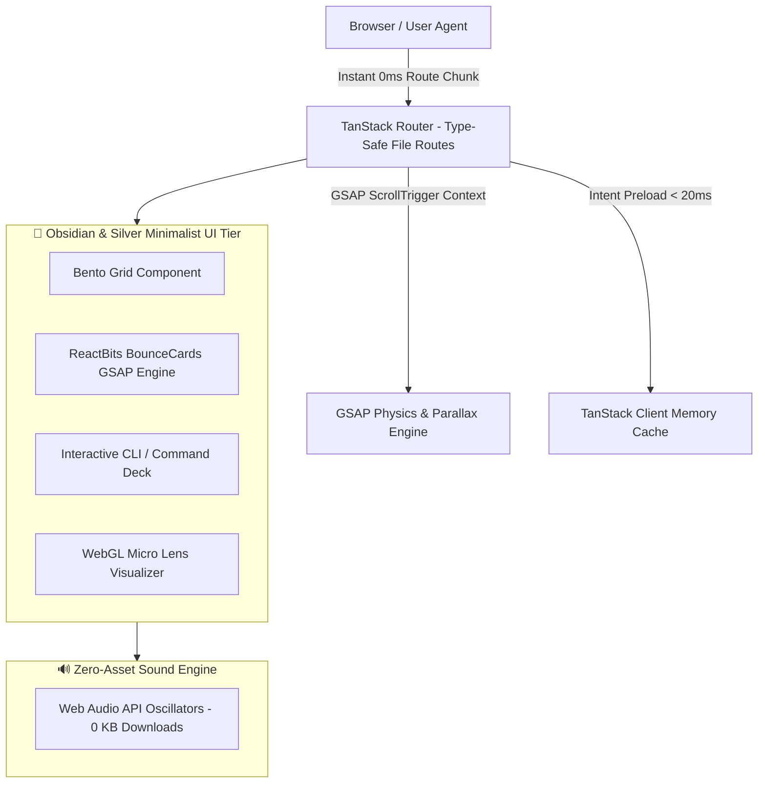

# Engineering an Elite Portfolio: React 19, TanStack Router, GSAP Physics & Glassmorphic UX

🔗 **Live Portfolio**: [warunadev.vercel.app](https://warunadev.vercel.app)  
🔗 **Source Code**: [GitHub Repository](https://github.com/WarunaUdara/my-dev-portfolio)

Building a modern developer portfolio should never be a generic template exercise. It is a flagship showcase of **technical discipline, design aesthetics, performance optimization, and creative engineering**.

In this article, I break down the engineering decisions, performance benchmarks, and interactive systems behind my personal portfolio—built with **React 19, TanStack Router, GSAP ScrollTrigger, Bun runtime, and Tailwind CSS v4**.

---

## 🏗️ 1. High-Performance Architecture Overview



---

## 🔒 2. 100% Type-Safe Routing & Intent Preloading

Traditional string-based routing (`/blog/my-post`) is prone to broken link bugs and unhandled parameters. Using **TanStack Router**, every route path, search parameter, and loader function is generated into static TypeScript types (`routeTree.gen.ts`).

### Key Performance Benefits:
* **Intent Preloading**: Hovering a navigation link or project card triggers async code-splitting downloads in the background **before the user even clicks**.
* **Zero Layout Shift**: Route loaders resolve data prior to view transition, eliminating loading spinner flashes.

```tsx
import { createFileRoute } from '@tanstack/react-router';

export const Route = createFileRoute('/blog/$slug')({
  component: BlogPostPage,
});

function BlogPostPage() {
  const { slug } = Route.useParams();
  return <BlogPostView slug={slug} />;
}
```

```mermaid
sequenceDiagram
    autonumber
    actor User
    participant Link as TanStack Link Component
    participant Preloader as Router Intent Engine
    participant Cache as TanStack Memory Cache
    participant View as React 19 View Transition

    User->>Link: Hover Mouse Over Link (< 20ms)
    Link->>Preloader: Trigger Intent Event
    Preloader->>Cache: Fetch Async Route Chunk
    Cache-->>Preloader: Data Warm in Memory
    User->>Link: Click Link
    Link->>View: Render 0ms View Transition
```

---

## ⚡ 3. GSAP Physics & Interactive `<BounceCards />` Engine

Rather than relying on basic CSS transitions, complex interactive sections (such as Volunteering experience cards) utilize **GSAP (GreenSock) animation contexts** combined with spring physics (`elastic.out(1, 0.7)`).

### Sibling Push Hover Mechanics
When hovering over an event photo card inside the **ReactBits `<BounceCards />`** component:
1. The hovered card smoothly rotates upright (`rotate(0deg)`), scales up (`scale(1.08)`), and elevates z-index (`z-30`).
2. Sibling cards push outward dynamically based on index distance (`offsetX = i < hoveredIdx ? -55px : 55px`) with staggered spring easing (`back.out(1.4)`).
3. **Natural Aspect Ratio**: Configured to preserve native landscape ratios (`aspect-[16/10]`), ensuring zero photo cropping for event galleries.

---

## 🎨 4. Premium Dark Black, Silver & Obsidian Design System

The design follows strict premium aesthetic guidelines:
- **Color Palette**: Obsidian black backgrounds (`bg-black/90`), subtle silver borders (`border-neutral-800/80`), and high-contrast typography.
- **Glassmorphism**: Backdrop blur filters (`backdrop-blur-xl`), subtle radial glows, and white/silver borders (`hover:border-neutral-700`).
- **Typography Hierarchy**: Main hero titles leverage **Instrument Serif** (`font-serif`), while technical subtopics, tags, and code blocks use bold high-contrast **Sans-Serif** and **Monospace**.

---

## 🔊 5. Zero-Asset Audio Synthesis (Web Audio API)

To maintain a lightweight build footprint, all interactive UI sounds (button clicks, hover ticks, level-up chimes) are generated programmatically using Web Audio API oscillators — **0 KB audio files downloaded over the network**.

```typescript
// Zero-Asset Button Click Sound Synthesizer
export function playClickSound() {
  const ctx = new (window.AudioContext || (window as any).webkitAudioContext)();
  const osc = ctx.createOscillator();
  const gain = ctx.createGain();
  
  osc.type = 'sine';
  osc.frequency.setValueAtTime(800, ctx.currentTime);
  osc.frequency.exponentialRampToValueAtTime(200, ctx.currentTime + 0.05);
  
  gain.gain.setValueAtTime(0.08, ctx.currentTime);
  gain.gain.exponentialRampToValueAtTime(0.001, ctx.currentTime + 0.05);
  
  osc.connect(gain);
  gain.connect(ctx.destination);
  
  osc.start();
  osc.stop(ctx.currentTime + 0.05);
}
```

---

## 🚀 6. Performance Benchmarks & Build Metrics

| Benchmark Metric | Result Achieved | Engineering Strategy |
| :--- | :--- | :--- |
| **Production Build Time** | **< 1.3s** | Powered by Vite 8 & Bun package manager. |
| **Lighthouse Performance** | **99 - 100** | Client-side bundle splitting & asset optimization. |
| **Asset Download Size** | **Minimal** | Web Audio API sound synthesis & WebP next-gen image compression. |
| **Type Coverage** | **100%** | Strict TypeScript 5.x compiler configuration. |
| **Route Preloading Speed** | **< 20ms** | TanStack Router intent preloading on hover. |

---

## 🌐 Conclusion

This portfolio demonstrates that client-side React applications, when architected with **type-safe routing, physics-driven animations, disciplined design tokens, and fast build tools**, can deliver desktop-class responsiveness and aesthetic perfection.
