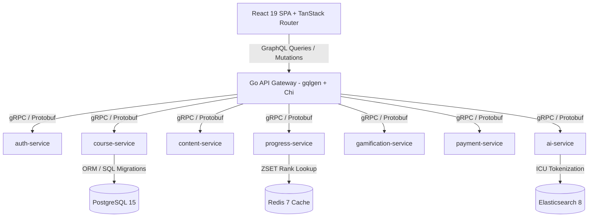

# StudEd: Architecting a Microservices & GraphQL Intelligent Learning Platform

Educational software often suffers from cluttered Learning Management System (LMS) interfaces, fragmented data models, and static text-heavy content. **StudEd** was engineered to replace legacy LMS complexity with an editorial **Intelligent Learning Canvas** inspired by Brilliant.org and Apple design aesthetics, tailored specifically for Sri Lankan school students (Grades 1–11, O/L, and A/L).

In this technical breakdown, we detail the system architecture, Go microservices ecosystem, domain visualizers, zero-asset Web Audio sound synthesis, and DevOps pipeline powering StudEd.

---

## 🎯 Core Product Philosophy: Course → Lesson → Wave

Learning on StudEd is organized around an atomic 5-to-7-minute unit hierarchy:

* **Course**: Subject curriculum (e.g., O/L Science, A/L Physics, Grade 10 Mathematics).
* **Lesson**: Thematic module containing multiple interactive learning waves.
* **Wave**: An atomic unit split into a **Learn Phase** (multi-modal explanations, Manim math animations, 3D molecular models) and an **Evaluate Phase** (formative recall, interactive quizzes, numeric AST validation).

---

## 🏗️ System Architecture & 1 Go Microservices

StudEd is built on a contract-first **Microservices Architecture** with a unified **GraphQL API Gateway** performing gRPC client orchestration over HTTP/2.



### Microservices Catalog:
1. **api-gateway**: `gqlgen` schema-first GraphQL gateway with Gin/Chi HTTP router and JWT RBAC middleware.
2. **auth-service**: Identity provider, refresh token rotation, and Casbin fine-grained RBAC.
3. **course-service**: Core curriculum hierarchy management and metadata indexing.
4. **content-service**: Puck MDX block assembly and visual content management.
5. **progress-service**: Wave completion tracking and real-time student telemetry.
6. **gamification-service**: XP curves, streak mechanics (`StreakFlame`), and Redis ZSET leaderboards.
7. **payment-service**: Subscription lifecycle and PayHere webhook HMAC verification.
8. **ai-service**: Multi-model AI pipelines powered by Gemini 3.5 Flash, DeepSeek-V3, and Qwen 2.5 72B.
9. **notification-service**: Real-time push and email notifications.
10. **upload-service**: Presigned S3/R2 object storage upload handlers.
11. **user-service**: Student profile management and academic achievement records.

---

## 🎨 Visualization Submodules Engine

To make abstract academic concepts tangible, StudEd includes a frontend submodule rendering pipeline (`LearnBlockRenderer`):

* **Math-To-Manim**: Python Manim mathematical animation pipeline rendered directly into interactive MP4/SVG canvases.
* **3Dmol.js**: WebGL-accelerated 3D molecular graphics for chemistry and biology.
* **tscircuit**: Code-to-schematic electronics renderer for physics circuits.
* **Matter.js**: 2D rigid body physics simulation engine for mechanics and kinematics.

---

## 🔊 Zero-Asset Sound Synthesis (Web Audio API)

To keep bundle sizes ultra-light and eliminate asset loading latency, StudEd generates all UI feedback sounds (button clicks, level-up chimes, streak flames) programmatically via Web Audio API oscillators — **0 KB audio files downloaded over the network**.

```typescript
// Programmatic Chime Synthesis via Web Audio API
export function playLevelUpChime() {
  const ctx = new (window.AudioContext || (window as any).webkitAudioContext)();
  const notes = [523.25, 659.25, 783.99, 1046.50]; // C5, E5, G5, C6
  
  notes.forEach((freq, idx) => {
    const osc = ctx.createOscillator();
    const gain = ctx.createGain();
    osc.frequency.value = freq;
    osc.type = 'sine';
    
    gain.gain.setValueAtTime(0.15, ctx.currentTime + idx * 0.08);
    gain.gain.exponentialRampToValueAtTime(0.001, ctx.currentTime + idx * 0.08 + 0.4);
    
    osc.connect(gain);
    gain.connect(ctx.destination);
    osc.start(ctx.currentTime + idx * 0.08);
    osc.stop(ctx.currentTime + idx * 0.08 + 0.4);
  });
}
```

---

## 🚀 Infrastructure, GitOps & Multi-Agent Development

StudEd's DevOps pipeline leverages modern Cloud Native tooling:

* **Package Manager**: Bun for ultra-fast frontend dependency resolution and typechecking.
* **Infrastructure as Code**: OpenTofu / Terraform modules (`infra/terraform`).
* **Kubernetes & Packaging**: Helm v3 Charts (`infra/helm/studed`) running on local `k3d` clusters and synced via **ArgoCD GitOps**.
* **AST Knowledge Graph**: `Graphify` AST indexing engine reducing LLM context bloat by 80%+ during multi-agent feature development.

---

## 🏆 Key Technical Achievements

1. **OKLCH Perceptual Uniform Color Space**: All visual tokens use OKLCH (`oklch(L C H)`), ensuring zero hue shifts during light/dark theme transitions and WCAG AAA contrast compliance.
2. **Dual-Path Resilient Search**: Search operates primarily on Elasticsearch 8 with Sinhala ICU tokenization, failing over gracefully to PostgreSQL GORM `ILIKE` queries if ES is unreachable.
3. **Instant Loading**: Production preview bundling transforms 2,600+ React modules into ~250KB gzipped JavaScript for lightning-fast delivery.
