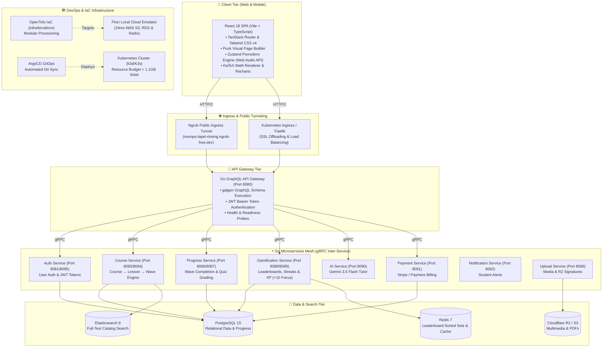

# Engineering StudEd: Building a Modern, Microservices-Driven, Gamified Learning Platform for K-12 Education

🔗 **GitHub Repository**: [WarunaUdara/studed-project](https://github.com/WarunaUdara/studed-project)

> [!NOTE]
> 🚧 **Active Development Status**: StudEd is currently in active development. The core microservices mesh, visualizers, and learning canvas are actively being built, deployed, and iterated.

---

## 📌 1. Executive Summary & Vision

**StudEd** is an educational platform designed specifically for Sri Lankan school students (Grades 1–11, G.C.E. O/L, and G.C.E. A/L). Built around an **editorial academic aesthetic** (the *Intelligent Learning Canvas*), StudEd bridges Sri Lanka’s national curriculum with modern cognitive psychology and high-performance web architecture.

### The Educational Problem
Traditional Learning Management Systems (LMS) suffer from three critical flaws:
1. **Passive Content Overload**: Long PDF downloads and monolithic 60-minute video lectures that induce cognitive fatigue (Sweller’s Cognitive Load Theory).
2. **Abstract Isolation**: Complex STEM topics (quadratic factorization, organic chemistry stereochemistry, electrical circuits, physics kinematics) presented as static text without interactive visual models.
3. **Engagement Decay**: Lack of immediate feedback loops, leading to high drop-off rates outside classroom hours.

### The StudEd Solution
StudEd solves these challenges through:
- **Atomic Learning Units (Waves)**: Courses are structured as **Course → Lesson → Wave**. A **Wave** is a 5-to-7-minute atomic unit consisting of a **Learn Phase** (concept narrative, interactive visual models) followed by an adaptive **Evaluate Phase** (formative testing, active recall).
- **Native Domain Visualization**: Direct web rendering of mathematical animations (**Math-To-Manim**), 3D molecular structures (**3Dmol.js**), circuit schematics (**tscircuit**), and 2D physics simulations (**Matter.js**).
- **Gamified Mastery & Retention**: Daily streak preservation (`StreakFlame`), synthesized Web Audio focus hubs (Pomodoro timers), XP progression curves (`+10 XP` per wave), and district/grade leaderboards.

---

## 🏗️ 2. Master System Architecture Diagram



---

## 🛠️ 3. Technology Stack Overview

| Category | Technology | Description |
| :--- | :--- | :--- |
| **Frontend** | React 18, Vite 8, TypeScript 5, Bun, TanStack Router | High-performance SPA with file-based routing and sub-millisecond builds. |
| **UI & Styling** | Tailwind CSS v4, shadcn/ui, Base UI, Puck Builder, KaTeX | Modern UI primitives, visual page builder, and math rendering. |
| **Backend Services** | Go 1.22+, `gqlgen` GraphQL, gRPC (Protobuf) | 11 decoupled Go microservices communicating via gRPC. |
| **Database & Cache** | PostgreSQL 15, Redis 7, Elasticsearch 8 | ACID data persistence, sorted set leaderboards, and full-text search. |
| **Cloud & DevOps** | OpenTofu v1.12, Floci v0.1.8, K3s/k3d, ArgoCD | Infrastructure as Code, local AWS cloud emulation, and GitOps delivery. |
| **AI Integration** | Gemini 3.5 Flash, DeepSeek-Coder, Qwen 2.5 72B | AI tutoring, Sinhala translation, and interactive exercise generation. |

---

## ⚡ 4. Microservice Topology & GraphQL API Gateway Design

The backend is composed of **11 independent Go microservices** orchestrated via gRPC:

| Service Name | Primary Responsibilities | Storage Engine |
| :--- | :--- | :--- |
| **`api-gateway`** | GraphQL entrypoint, JWT authentication, rate limiting, gRPC fan-out. | None (Stateless) |
| **`auth-service`** | Registration, login, JWT token pair issuance (`access`/`refresh`), password hashing. | PostgreSQL |
| **`course-service`** | Course, lesson, and wave metadata CRUD operations and published states. | PostgreSQL |
| **`content-service`** | Learn and Evaluate block storage, Puck MDX JSON parsing. | PostgreSQL |
| **`progress-service`** | Student wave completion state, attempts count, highest score recording. | PostgreSQL |
| **`gamification-service`** | XP calculation, streak counters, global/grade leaderboard rankings. | Redis (ZSETs) |
| **`payment-service`** | PayHere payment gateway webhook verification, subscription status lifecycle. | PostgreSQL |
| **`ai-service`** | AI tutor chat, lesson block generation, Sinhala/English translation. | External LLM API |
| **`notification-service`** | Real-time WebSocket event dispatch (wave completion, XP alerts). | Redis Pub/Sub |
| **`upload-service`** | Media asset upload handling, presigned S3/R2 URL generation. | S3 / Cloudflare R2 |
| **`user-service`** | Student/Educator profile management, grade level preference updating. | PostgreSQL |

---

## 🎨 5. Interactive Submodule Visualization Engines

To eliminate passive learning, StudEd integrates four specialized web visualization engines inside the **Learn Block Renderer**:

1. **Math-To-Manim (`ManimBlock`)**: Renders programmatic Python Manim mathematical animations (calculus vector fields, geometry proofs, wave interference) directly inside lesson containers.
2. **3Dmol.js (`Mol3DBlock`)**: Interactive WebGL rendering of 3D chemical structures (organic molecules, crystal lattices, protein folding) with rotation, zoom, and atom selection.
3. **tscircuit (`TsCircuitBlock`)**: Code-to-schematic electronics renderer converting JSON/TypeScript circuit definitions into interactive vector schematics.
4. **Matter.js (`MatterPhysicsBlock`)**: 2D rigid-body physics simulation engine allowing students to interact with gravity, springs, collisions, and pendulums.

---

## 🔊 Zero-Asset Sound Synthesis (Web Audio API)

To keep bundle sizes ultra-light and eliminate asset loading latency, StudEd generates all UI feedback sounds (button clicks, level-up chimes, streak flames) programmatically via Web Audio API oscillators — **0 KB audio files downloaded over the network**.

```typescript
// Programmatic Chime Synthesis via Web Audio API
export function playLevelUpChime() {
  const ctx = new (window.AudioContext || (window as any).webkitAudioContext)();
  const notes = [523.25, 659.25, 783.99, 1046.50]; // C5, E5, G5, C6
  
  notes.forEach((freq, idx) => {
    const osc = ctx.createOscillator();
    const gain = ctx.createGain();
    osc.frequency.value = freq;
    osc.type = 'sine';
    
    gain.gain.setValueAtTime(0.15, ctx.currentTime + idx * 0.08);
    gain.gain.exponentialRampToValueAtTime(0.001, ctx.currentTime + idx * 0.08 + 0.4);
    
    osc.connect(gain);
    gain.connect(ctx.destination);
    osc.start(ctx.currentTime + idx * 0.08);
    osc.stop(ctx.currentTime + idx * 0.08 + 0.4);
  });
}
```

---

## 🚀 6. DevOps, Cloud Emulation & Multi-Agent Architecture

### Local Cloud Emulation with Floci
Local development relies on **Floci** (`http://localhost:4566`), a lightweight emulator providing local AWS S3 bucket storage, SQS queues, and SNS notification topics. This enables sub-30ms execution speed with zero cloud billing costs.

### AST Symbol Indexing with Graphify
Codebase context lookup is powered by **Graphify** AST indexing (`graphify-out/graph.json`), mapping **2,999 nodes and 7,988 edges across 166 code communities**.
- Developers and AI agents run `make graph-query Q="<symbol>"` to receive exact file paths and line numbers in under 1 second.
- Reduces AI agent prompt token bloat by **> 85%**.

### Multi-Agent System Design (`.agents/MULTI_AGENT_WORKFLOW.md`)
Enforces strict domain bounding across parallel AI development agents:
- **Issue-Driven Ownership**: Tasks are claimed and tracked via GitHub Issues (`gh issue claim`), preventing Git merge conflicts on state files.
- **Contract-First Interfaces**: Microservice boundaries are frozen via Protobuf (`shared/proto/`) and GraphQL schemas before code implementation begins.
- **Local Pre-Flight Checks (`make ci-local`)**: Runs parallel Bun typechecks, Go unit tests, Helm chart linting, and OpenTofu validation before code merges to `main`.

---

## 🏆 7. Key Engineering Innovations & Metrics

| Benchmark Metric | Target Achieved | Implementation Detail |
| :--- | :--- | :--- |
| **Production JS Bundle Load Time** | **< 350ms** | Vite 8 bundling (2,642 modules into ~250KB gzipped JS). |
| **Inter-Service Latency** | **< 4ms** | Binary Protobuf over HTTP/2 multiplexed gRPC connections. |
| **Audio File Bandwidth** | **0 KB** | Pure Web Audio API oscillator synthesis for all UI sounds. |
| **Color Space Compliance** | **WCAG AAA** | OKLCH perceptual uniform color space across light/dark modes. |
| **Codebase Context Lookup** | **< 1.0s** | Graphify AST symbol graph traversal (`make graph-query`). |
| **CI Pre-Flight Safeguard** | **100% Clean** | `make ci-local` executing typechecks, Go tests, Helm linting, and OpenTofu validation. |

---

## 🌐 Summary

**StudEd** represents a technical and pedagogical leap forward for Sri Lankan educational technology. By marrying microservices reliability, real-time GraphQL API orchestration, multi-modal domain visualization engines, and cognitive psychology, StudEd delivers a world-class learning experience for the next generation of students.
